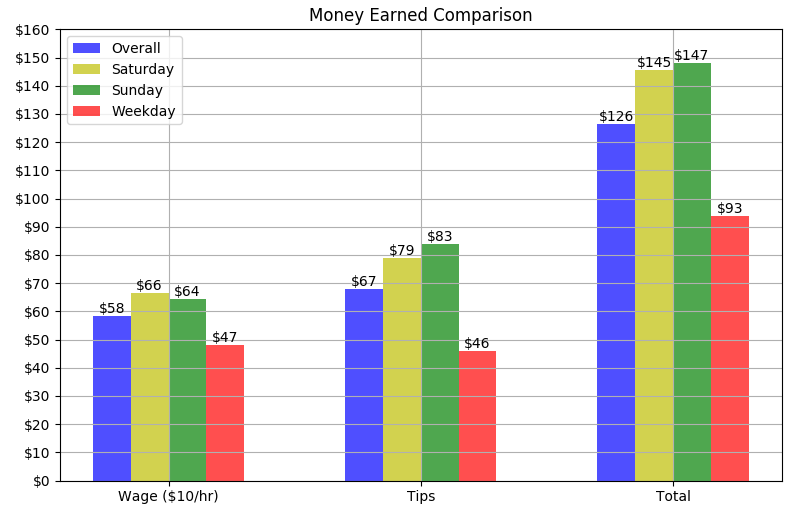

FINISHED 02/10/19
## My Average Earnings per Day as a Server

Every day for nearly a year, I recorded how much I earned working as a server as well as how many hours I worked per day. 
I took the data from all of the logged days from 2016 March - December.
This includes the gross tips and salary as well as the days of the week.

# The averages of my earnings from a year's worth of data and projected earnings for the next three months.

Hourly total: $21.6

Projected 3mo. total: $2902.92

